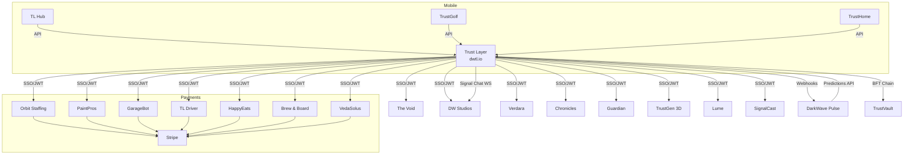

# Trust Layer Ecosystem

> 26 repositories · 1 blockchain · 1 SSO backbone · Render (Ohio)

## Dependency Map

```
                              ┌─────────────────┐
                              │  TRUST LAYER     │
                              │  (dwtl.io)       │
                              │  ─────────────── │
                              │  SSO · BFT Chain │
                              │  Signal Chat     │
                              │  Pulse AI Engine │
                              │  Hallmark Stamps │
                              └────────┬────────┘
                                       │
               ┌───────────────────────┼───────────────────────┐
               │                       │                       │
       ┌───────▼───────┐      ┌───────▼───────┐      ┌───────▼───────┐
       │  WEB APPS     │      │  MOBILE APPS  │      │  AI/CRYPTO    │
       │  (Express+    │      │  (Expo/RN)    │      │  PLATFORMS    │
       │   React+Vite) │      │               │      │               │
       └───────┬───────┘      └───────┬───────┘      └───────┬───────┘
               │                      │                       │
    ┌──────────┼──────────┐    ┌──────┼──────┐    ┌──────────┼──────┐
    │          │          │    │      │      │    │          │      │
    ▼          ▼          ▼    ▼      ▼      ▼    ▼          ▼      ▼
 Business   Service    Social Hub   Golf  Home  Pulse    Lume   TrustGen
  Apps      Apps       Apps                      (AI)   (Lang)   (3D)
```

## All Repositories

### Core Infrastructure

| Repo | Domain | Purpose | Auth |
|---|---|---|---|
| **trust-layer** | [dwtl.io](https://dwtl.io) | SSO backbone, BFT-PoA chain, Signal Chat, Pulse engine | — |
| **dwsc** | [dwsc.io](https://dwsc.io) | Legacy redirect → dwtl.io | TL SSO |
| **trustvault** | [trustvault.tlid.io](https://trustvault.tlid.io) | Secure document vault | TL SSO |

---

### AI & Crypto Platforms

| Repo | Domain | Purpose | Auth |
|---|---|---|---|
| **darkwavepulse** | [darkwavepulse.com](https://darkwavepulse.com) | AI crypto trading (Mastra agents, StrikeAgent) | Firebase + TL |
| **lume** | [lume-lang.org](https://lume-lang.org) | AI-native programming language & playground | TL SSO |
| **trustgen-3d** | [trustgen.tlid.io](https://trustgen.tlid.io) | AI 3D asset generation | TL SSO |
| **guardianscreener** | [guardianscreener.tlid.io](https://guardianscreener.tlid.io) | Crypto token security scanner | TL SSO |

---

### Business Applications

| Repo | Domain | Purpose | Payments |
|---|---|---|---|
| **orbitstaffing** | [orbitstaffing.io](https://orbitstaffing.io) | Enterprise staffing OS (16K route lines) | Stripe |
| **paintpros** | [paintpros.io](https://paintpros.io) | Painting contractor management | Stripe |
| **garagebot** | [garagebot.io](https://garagebot.io) | Automotive garage management | Stripe |
| **lotopspro** | [lotopspro.io](https://lotopspro.io) | Dealer lot operations | — |
| **TLDriverConnect** | [tldriverconnect.com](https://tldriverconnect.com) | Transportation/dispatch management | Stripe |
| **happyeats** | [happyeats.app](https://happyeats.app) | Multi-tenant restaurant platform | Stripe |
| **brewandboard** | [brewandboard.coffee](https://brewandboard.coffee) | Board game café platform | Stripe |
| **vedasolus** | [vedasolus.io](https://vedasolus.io) | Wellness/holistic health | Stripe |
| **verdara** | [verdara.tlid.io](https://verdara.tlid.io) | Sustainability & ESG reporting | — |

---

### Social & Community

| Repo | Domain | Purpose | Auth |
|---|---|---|---|
| **thevoid** | [intothevoid.app](https://intothevoid.app) | Immersive social spaces | TL SSO |
| **chronicles** | [yourlegacy.io](https://yourlegacy.io) | Interactive RPG (Three.js) | TL SSO |
| **signalcast** | — | AI social media automation | TL SSO |
| **darkwavestudios** | [darkwavestudios.io](https://darkwavestudios.io) | Developer IDE & portal | TL SSO |
| **bomber-3d** | [bomber.tlid.io](https://bomber.tlid.io) | Long-drive 3D golf game | TL SSO |

---

### Mobile Apps (Expo)

| Repo | Domain | Purpose |
|---|---|---|
| **trust-layer-hub** | [trusthub.tlid.io](https://trusthub.tlid.io) | Ecosystem companion app |
| **trustgolf** | [trustgolf.app](https://trustgolf.app) | Golf score tracking |
| **trusthome** | [trusthome.tlid.io](https://trusthome.tlid.io) | Real estate/property |
| **lot-ops-pro-manheim** | — | Lot Ops Pro mobile (Manheim) |

## Cross-Service Dependencies



## Shared Stack

All web apps (unless noted) use:

| Layer | Technology |
|---|---|
| Runtime | Node.js 22 |
| Frontend | React 19 + Vite 7 |
| UI Library | Radix UI |
| Backend | Express + TypeScript |
| ORM | Drizzle |
| Database | PostgreSQL (Neon serverless) |
| Auth | Trust Layer SSO (JWT) |
| Payments | Stripe |
| Email | Resend |
| Hosting | Render (Ohio, starter plan) |

## CORS Allowlist (Trust Layer)

Apps that can authenticate through the Trust Layer SSO:

```
dwtl.io · tlid.io · darkwavegames.io · darkwavestudios.io
yourlegacy.io · chronochat.io · trustshield.tech
```

## Environment Variables (Ecosystem-Wide)

| Variable | Used By | Purpose |
|---|---|---|
| `DATABASE_URL` | All | PostgreSQL connection |
| `SESSION_SECRET` | All web apps | Express session signing |
| `JWT_SECRET` | Apps with SSO | Token verification |
| `STRIPE_SECRET_KEY` | Payment apps | Payment processing |
| `STRIPE_WEBHOOK_SECRET` | Payment apps | Webhook validation |
| `TRUST_LAYER_API_KEY` | All apps | SSO authentication |
| `OPENAI_API_KEY` | Pulse, Lume, TrustGen | AI features |
| `RESEND_API_KEY` | All apps | Transactional email |
